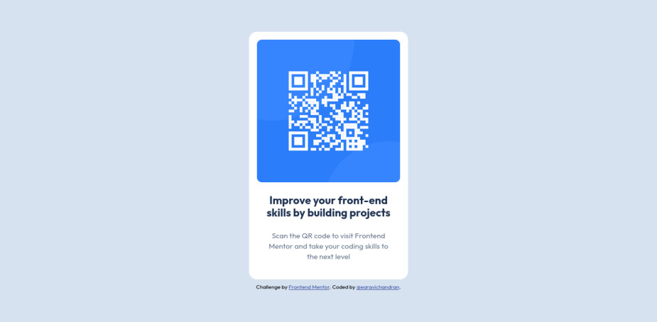

# Frontend Mentor - QR code component solution

This is a solution to the [QR code component challenge on Frontend Mentor](https://www.frontendmentor.io/challenges/qr-code-component-iux_sIO_H). Frontend Mentor challenges help you improve your coding skills by building realistic projects.

## Table of contents

- [Overview](#overview)
  - [Screenshot](#screenshot)
  - [Links](#links)
- [My process](#my-process)
  - [Built with](#built-with)
  - [What I learned](#what-i-learned)
  - [Continued development](#continued-development)
  - [Useful resources](#useful-resources)
- [Author](#author)
- [Acknowledgments](#acknowledgments)

## Overview

### Screenshot




### Links

- Solution URL: [Add solution URL here](https://your-solution-url.com)
- Live Site URL: [Add live site URL here](https://your-live-site-url.com)

## My process

### Built with

- Semantic HTML5 markup
- CSS custom properties
- Flexbox

### What I learned

From this project, I learned how fix the images in the parent container and flexbox properties to center the card. The style.css is given below:

```css
* {
  margin: 0;
  padding: 0;
  box-sizing: border-box;
}

:root {
  --bg-color: hsl(212, 45%, 89%);
  --accent-color: hsl(0, 0%, 100%);
  --primary-color: hsl(218, 44%, 22%);
  --secondary-color: hsl(216, 15%, 48%);

  --ff-primary: "Outfit", sans-serif;
  --fw-regular: 700;
  --fw-thin: 400;
  --fs-regular: 15px;
}

body {
  font-family: var(--ff-primary);
  background-color: var(--bg-color);
  height: 100vh;

  display: flex;
  flex-direction: column;
  align-items: center;
  justify-content: center;
}
.container {
  width: 320px;
  background-color: var(--accent-color);
  padding: 1rem;
  border-radius: 1rem;
}

img {
  width: 100%;
  border-radius: 0.625rem;
}

h1 {
  font-size: 1.375rem;
  color: var(--primary-color);
  text-align: center;
  margin-top: 0.5rem;
  padding: 0.75rem;
  line-height: 1.1;
}

p {
  font-size: var(--fs-regular);
  color: var(--secondary-color);
  text-align: center;
  padding: 0.75rem;
  margin-bottom: 0.5rem;
  line-height: 1.4;
}
```

### Continued development

I keep focusing on learning the fundamentals of css.

### Useful resources

- [For Flexbox, CSSTricks.com](https://css-tricks.com/snippets/css/a-guide-to-flexbox/) - This helped me the visualized concept of CSS flexbox and its properties.
- [Width and Height: Youtube video from Kevin Powell](https://www.youtube.com/watch?v=6aHKdahOfCc) - This video is very helpful for fixing the images in the parent container.

## Author

- Frontend Mentor - [@earavichandran](https://www.frontendmentor.io/profile/earavichandran)
- Github account -[@earavichandran](https://github.com/earavichandran)

## Acknowledgments

I thank the Frontent mentor for designing this project. I thank to Kevin Powell and Brad Travesy for excellent youtube resources. I learned lot from them.
